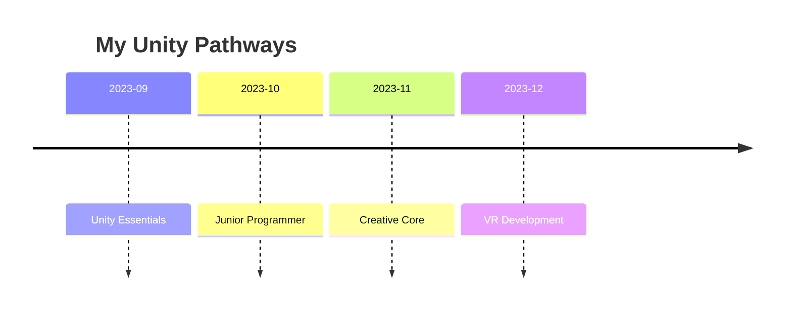

紀錄一下學習 Unity 的計畫、筆記與心得

## Action Plan

| Milestones to reach my goal   | Actions I will take to reach my goal   | Timeline for each action | Outcome so I know I’m on the right path to reach my goal                        |
| :---------------------------- | :------------------------------------- | :----------------------- | :------------------------------------------------------------------------------ |
| 1. Learn how to use Unity     | Complete the Unity Essentials Pathway  | 1 weeks                  | Take note of important points. Learn from the attitudes of established creators |
| 2. Learn how to code in Unity | Complete the Junior Programmer Pathway | 4 weeks                  | Search for useful packages and generate my libraries.                           |
| 3. Create my own assets       | Complete the Creative Core Pathway     | 4 weeks                  | Unique Style Assets                                                             |
| 4. Single Player 3D Game      | Design and Build some 3D Game Objects  | 4 weeks                  | Create a 3D Game                                                                |
| 5. VR Project                 | Familiar VR Components                 | 4 weeks                  | Create VR Application for Learning Language                                     |

## Pathways

- [ ] Basic
  - [x] Unity Essentials
  - [x] Junior Programmer
  - [x] Creative Core
  - [ ] VR Development
  - [ ] Mobile AR Development

## Timeline

