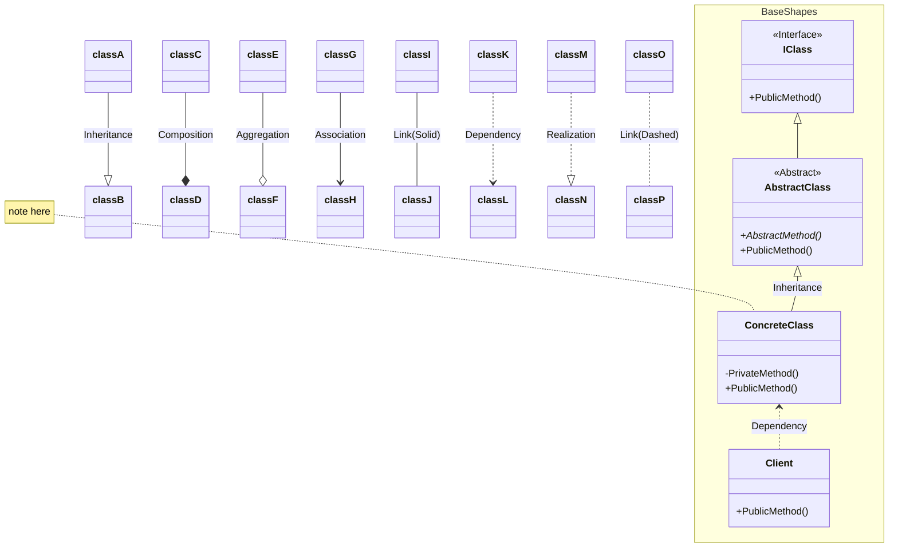

## 用途

> Description


```mermaid
classDiagram
  classA --|> classB : Inheritance
  classC --* classD : Composition
  classE --o classF : Aggregation
  classG --> classH : Association
  classI -- classJ : Link(Solid)
  classK ..> classL : Dependency
  classM ..|> classN : Realization
  classO .. classP : Link(Dashed)
  note for ConcreteClass "note here"
  IClass <|-- AbstractClass
  AbstractClass <|-- ConcreteClass : Inheritance
  ConcreteClass <.. Client : Dependency
  namespace BaseShapes {
    class IClass{
      <<Interface>>
      +PublicMethod()
    }
    class AbstractClass{
      <<Abstract>>
      +AbstractMethod()*
      +PublicMethod()
    }
    class ConcreteClass{
      -PrivateMethod()
      +PublicMethod()
    }
    class Client{
      +PublicMethod()
    }
  }

```

## 例子

<mark>Class(Type)</mark><br>

### Class

```csharp

```

## 延伸
