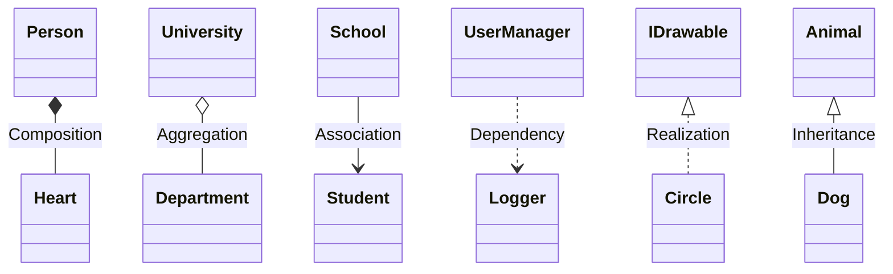

## 說明

這篇文章說明<b>物件導向</b>程式設計中 描述類別之間關係的術語，並以 C#實際例子解釋

## 圖示



## Composition (組合)

- 組合表示一種強烈的"擁有"關係，其中一個類別的物件包含了另一個類別的物件，且它們的生命週期是相依的。
- 實例：

```cs
public class Heart
{
    // Heart implementation
}

public class Person
{
    private Heart personHeart = new Heart();

    // Person implementation
}
```

> 在這個例子中，Person 類別擁有一個 Heart 類別的物件，而且 Person 的生命週期決定了 Heart 的生命週期。

## Aggregation (聚合)

- 聚合表示一種"有一個"的關係，其中一個類別的物件包含了另一個類別的物件，但它們的生命週期是獨立的。
- 實例：

```cs
public class Department
{
    // Department implementation
}

public class University
{
    private List<Department> departments = new List<Department>();

    // University implementation
}
```

> 在這個例子中，University 包含多個 Department，但它們的生命週期是獨立的。

## Association (聯想)

- 聯想表示兩個類別之間的關係，可以是雙向的，但並不指定生命週期的依賴。
- 實例：

```cs
public class Teacher
{
    // Teacher implementation
}

public class Student
{
    // Student implementation
}

public class School
{
    private List<Teacher> teachers = new List<Teacher>();
    private List<Student> students = new List<Student>();

    // School implementation
}
```

> 在這個例子中，School 類別與 Teacher 和 Student 類別有一種聯想的關係。

## Dependency (依賴)

- 依賴表示一種類別依賴於另一個類別，通常體現在方法參數或方法返回值上。
- 實例：

```cs
public class Logger
{
    public void Log(string message)
    {
        // Log implementation
    }
}

public class UserManager
{
    private Logger logger;

    public UserManager(Logger logger)
    {
        this.logger = logger;
    }

    // UserManager implementation using Logger
}
```

> 在這個例子中，UserManager 依賴於 Logger，因為它接收 Logger 物件作為構造函數的參數。

## Realization (實現)

- 實現表示一個類別實現了一個介面或抽象類別的約定。
- 實例：

```cs
public interface IDrawable
{
    void Draw();
}

public class Circle : IDrawable
{
    public void Draw()
    {
        // Circle drawing implementation
    }
}
```

> 在這個例子中，Circle 類別實現了 IDrawable 介面的約定，即必須實現 Draw 方法。

## Inheritance (繼承)

- 允許一個類別（子類別）繼承另一個類別（父類別）的屬性和方法。
- 實例：

```cs
public class Animal
{
    public string Name { get; set; }

    public void Eat()
    {
        Console.WriteLine($"{Name} is eating.");
    }
}

public class Dog : Animal
{
    public void Bark()
    {
        Console.WriteLine($"{Name} is barking.");
    }
}
```

> 在這個例子中，Animal 是一個基底類別（父類別），而 Dog 和 Cat 是衍生類別（子類別）。
