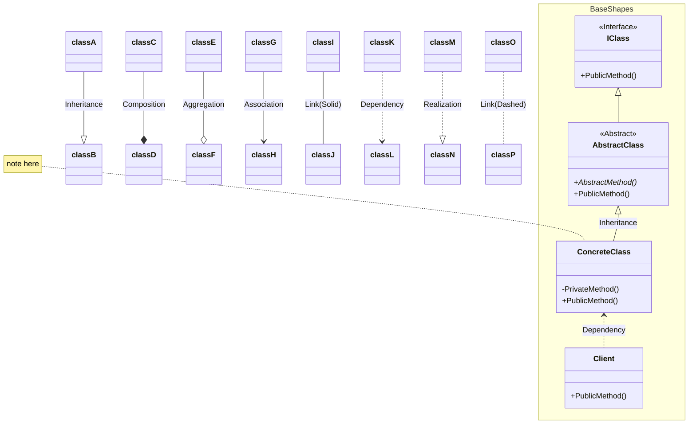

## 用途

> Description



## 例子

假設我們有一家汽車製造公司，可以生產多個品牌的汽車，如 Toyota 和 Honda。
而每個品牌的汽車又可以有不同的型號，如 Camry 和 Accord。

在這個例子中，我們可以將抽象工廠定義為汽車製造工廠，該工廠可以生產不同品牌的汽車。
抽象工廠具有一組相關方法，如製造汽車的方法。
而具體工廠則是實際的汽車製造廠商，如 Toyota 工廠和 Honda 工廠，它們實現了抽象工廠的方法。

接下來，我們還需要定義汽車的抽象類別或介面，它們定義了汽車的共同屬性和行為。
例如，汽車有品牌、型號和行駛方法等屬性和方法。

最後，我們有具體的汽車類別，如 ToyotaCamry 和 HondaAccord，它們實現了汽車的抽象類別或介面，並提供了特定品牌和型號的實現。

這樣，當我們需要生產汽車時，我們可以根據不同的品牌和型號使用對應的具體工廠，它們將根據所選的工廠生產出對應品牌和型號的汽車。
我們就可以通過抽象工廠模式實現彈性的汽車生產，而不需要直接依賴於具體的汽車製造商。

總結來說，抽象工廠模式將相關的產品家族組織在一起，並提供一個統一的介面來生產這些產品，同時隱藏了具體產品的實現細節。
這樣可以使客戶端代碼與具體產品的實現解耦，提高代碼的可擴展性和可維護性。

<mark>Class(Type)</mark><br>

### Class

```csharp

```

## 延伸
