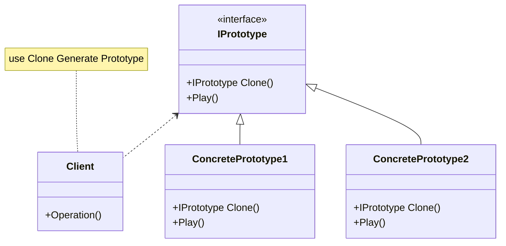

## 用途

> 通過<mark>複製(Clone)</mark>一個已經存在的實例來返回新的實例，而不是<mark>新建(new)</mark>實例。
> 
> 被複製的實例就是我們所稱的「原型」，這個原型是可定製的。



## 例子

當談到原型模式（Prototype Pattern），我們可以想像一個製作玩具的工廠。<br/>
假設我們有一個玩具原型，例如一隻小熊玩偶，<br/>
我們可以使用該原型來製造多個相同的玩具，而無需從頭開始設計和建造每一個。<br/>

在這個例子中，原型模式的角色如下：

### 原型（Prototype）：
  這是玩具的原型，例如小熊玩偶。<br/>
  它定義了一個方法，可以複製自己來創建新的實例。
### 具體原型（Concrete Prototype）：
  這是原型的具體實現，即實際的小熊玩偶。<br/>
  它實現了複製自己的方法，以便能夠創建相同的實例。
### 客戶端（Client）：
  這是使用原型模式的程式碼，負責創建和使用玩具的實例。<br/>
  它向原型發送複製的請求，並使用複製的實例進行操作，而不是直接創建新的實例。

### Prototype Interface

``` csharp
// 定義原型介面
public interface IToyPrototype
{
    IToyPrototype Clone();
    void Play();
}
```

### Concrete Prototype

``` csharp
// 定義原型介面
public class BearToy : IToyPrototype
{
    public IToyPrototype Clone()
    {
        // 使用淺層複製，即創建一個新實例並複製成員的值
        return (IToyPrototype)MemberwiseClone();
    }

    public void Play()
    {
        Console.WriteLine("Playing with a bear toy!");
    }
}
```

### Client

``` csharp
// 創建玩具原型
using PrototypePattern.Toy;

IToyPrototype bearToyPrototype = new BearToy();

// 使用原型創建新的玩具實例
IToyPrototype toy1 = bearToyPrototype.Clone();
IToyPrototype toy2 = bearToyPrototype.Clone();

// 操作玩具實例
toy1.Play();
toy2.Play();
```

## 延伸
C# ICloneable 介面
