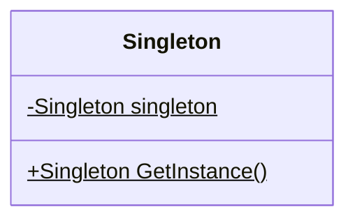

## 用途

在軟體開發中，單例模式(Singleton Pattern)用於確保一個類別只能創建一個實例<br/>並提供一個全域的訪問點來獲取這個唯一的實例



## 例子

當談到單例模式時，我們可以使用一個現實生活的例子來解釋，比如一個公司的 CEO。<br/>
假設有一家公司，這家公司只能有一個 CEO，這位 CEO 在整個公司中是唯一的。<br/>
無論何時，任何人都只能與這位 CEO 互動，不能創建多個 CEO。<br/>

在這個例子中，CEO 就是單例模式的實例。<br/>
這位 CEO 的特點是，無論何時，任何人都只能獲取到同一個 CEO 實例，無法創建多個不同的 CEO。<br/>

### Singleton

``` csharp
public class CEO
{
    private static CEO _instance;

    // 私有的構造函式，防止外部創建實例
    private CEO()
    {
        // 執行初始化操作
    }

    // 全域的訪問點，用於獲取唯一的 CEO 實例
    public static CEO GetInstance()
    {
        if (_instance == null)
        {
            // 如果實例為空，則創建一個新的 CEO 實例
            _instance = new CEO();
        }

        return _instance;
    }

    public void DoWork()
    {
        // 執行 CEO 的工作任務
    }
}
```

### Client

``` csharp
CEO ceo1 = CEO.GetInstance();
CEO ceo2 = CEO.GetInstance();

// 因為只能創建一個 CEO 實例，所以 ceo1 和 ceo2 是同一個實例
Console.WriteLine(ceo1 == ceo2); // 輸出: True

ceo1.DoWork();
```

## 延伸

這邊的 GetInstance 可以搭配 [Double-Checked Locking Pattern](/posts/Double-Checked-Locking-Pattern) 使用
