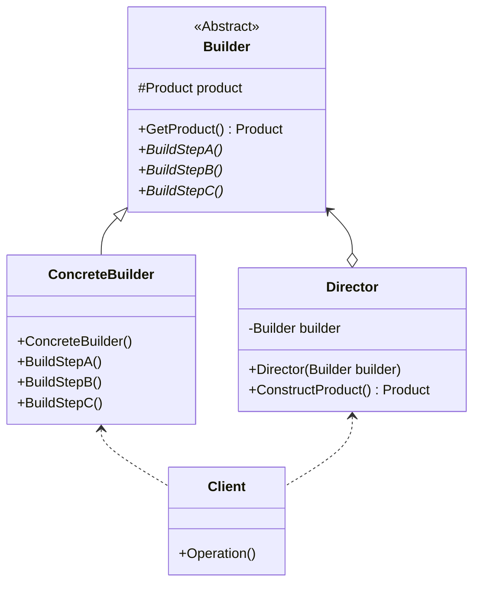

## 用途

> 將複雜對象的建造過程抽象出來（抽象類別），使這個抽象過程的不同實現方法可以構造出不同表現（屬性）的對象。



## 例子

我們以一個簡單的汽車建造過程為例子<br/>

<mark>汽車（Car）</mark><br/>
它有多個屬性，例如引擎類型、車身顏色、輪胎尺寸等等。<br/>
我們希望能夠按照一定的步驟來建造汽車。<br/>

<mark>汽車建造者（CarBuilder）</mark><br/>
它負責定義建造汽車的每個部分。<br/>
建造者類中包含與汽車相關的屬性，並提供設置這些屬性的方法。<br/>

<mark>具體的汽車建造者（ConcreteCarBuilder）</mark><br/>
它繼承自汽車建造者類。<br/>
在具體汽車建造者類中，我們實現了建造每個部分的具體方法<br/>
例如設置引擎類型、設置車身顏色、設置輪胎尺寸等等。<br/>

<mark>指揮者（Director）</mark><br/>
它負責按照特定的順序來執行建造者的方法，以建造出完整的汽車對象。<br/>
指揮者類接收一個汽車建造者對象作為參數，然後按照一定的步驟來執行建造者的方法，最終獲得建造好的汽車對象。<br/>

我們可以在客戶代碼中使用建造者模式來建造汽車<br/>
創建一個汽車建造者對象，然後將其傳遞給指揮者對象。<br/>
指揮者對象按照特定的順序來執行建造者的方法，最終獲得建造好的汽車對象。<br/>

### Product

```csharp
public class Car
{
    public string EngineType { get; set; }
    public string Color { get; set; }
    public string TireSize { get; set; }
    // 其他屬性...
}
```

### Aabstract Builder

```csharp
// 汽車建造者抽象類
public abstract class CarBuilder
{
    protected Car car;

    public Car GetCar()
    {
        return car;
    }

    public abstract void SetEngineType();
    public abstract void SetColor();
    public abstract void SetTireSize();
    // 其他建造方法...
}
```

### Concrete Builder

```csharp
// 具體汽車建造者類
public class ConcreteCarBuilder : CarBuilder
{
    public ConcreteCarBuilder()
    {
        car = new Car();
    }

    public override void SetEngineType()
    {
        car.EngineType = "V8";
    }

    public override void SetColor()
    {
        car.Color = "Red";
    }

    public override void SetTireSize()
    {
        car.TireSize = "18 inches";
    }
}
```

### Director

```csharp
// 指揮者類
public class Director
{
    private CarBuilder carBuilder;

    public Director(CarBuilder builder)
    {
        carBuilder = builder;
    }

    public Car ConstructCar()
    {
        carBuilder.SetEngineType();
        carBuilder.SetColor();
        carBuilder.SetTireSize();
        // 可以按照需要添加其他步驟
        return carBuilder.GetCar();
    }
}
```

### Client

```csharp
CarBuilder builder = new ConcreteCarBuilder();

// 創建指揮者並傳入汽車建造者
Director director = new Director(builder);

// 建造汽車
Car car = director.ConstructCar();

// 使用建造好的汽車對象
Console.WriteLine($"Engine Type: {car.EngineType}");
Console.WriteLine($"Color: {car.Color}");
Console.WriteLine($"Tire Size: {car.TireSize}");
```

## 延伸
