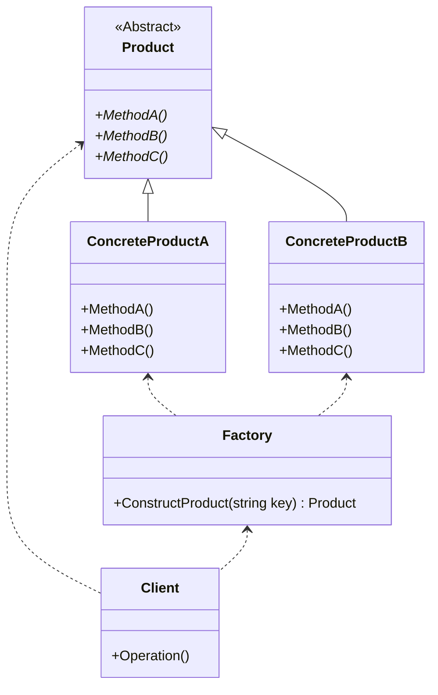

## 用途

> 在軟體開發中，簡單工廠模式用於封裝物件的創建邏輯，
>
> 客戶只需要提供必要的參數，而不需要關心具體的物件創建過程。



## 例子

我們可以使用一個生活中的例子來解釋，比如一家<b>披薩店</b>。

假設有一家<mark>披薩店</mark>，該店提供多種不同口味的<mark>披薩</mark>，如<mark>芝士披薩</mark>、<mark>蘑菇披薩</mark>和<mark>火腿披薩</mark>等。<br>
<mark>客戶</mark>在點餐時只需要提供披薩的口味，而不需要關心每種披薩如何製作。

在這個例子中，<br>
<mark>披薩店(Factory)</mark>就是簡單工廠，<br>
而<mark>披薩(Product)</mark>則是由簡單工廠根據<mark>客戶(Client)</mark>點餐的要求來創建。<br>
客戶只需要告訴披薩店要的<mark>披薩口味(Key)</mark>，披薩店就會根據這個要求創建<mark>相應的披薩(ConcreteProduct)</mark>。

### Aabstract/Interface Product

```cs
// 抽象披薩類別
public abstract class Pizza
{
    public abstract void Prepare();
    public abstract void Bake();
    public abstract void Cut();
    public abstract void Box();
}
```

### Concrete Product

```cs
// 具體的起司披薩
public class CheesePizza : Pizza
{
    public override void Prepare()
    {
        Console.WriteLine("Preparing Cheese Pizza");
    }

    public override void Bake()
    {
        Console.WriteLine("Baking Cheese Pizza");
    }

    public override void Cut()
    {
        Console.WriteLine("Cutting Cheese Pizza");
    }

    public override void Box()
    {
        Console.WriteLine("Boxing Cheese Pizza");
    }
}
```

### Simple Factory

```cs
// 簡單披薩工廠
public class SimplePizzaFactory {
    public Pizza CreatePizza(string type) {
        Pizza pizza = null;

        // 根據口味創建相應的披薩
        switch (type) {
            case "cheese":
                pizza = new CheesePizza();
                break;
            case "mushroom":
                pizza = new MushroomPizza();
                break;
            case "pepperoni":
                pizza = new PepperoniPizza();
                break;
            default:
                // 如果口味不匹配，可以在這裡執行一些預設的處理邏輯，如創建一個預設的披薩或拋出異常等
                break;
        }

        return pizza;
    }
}
```

### Client

```cs
SimplePizzaFactory factory = new SimplePizzaFactory();

// 客戶點餐：起司披薩
Pizza cheesePizza = factory.CreatePizza("cheese");
cheesePizza.Prepare();
cheesePizza.Bake();
cheesePizza.Cut();
cheesePizza.Box();

Console.WriteLine();

// 客戶點餐：蘑菇披薩
Pizza mushroomPizza = factory.CreatePizza("mushroom");
mushroomPizza.Prepare();
mushroomPizza.Bake();
mushroomPizza.Cut();
mushroomPizza.Box();
```

## 延伸
搭配其他設計模式使用
