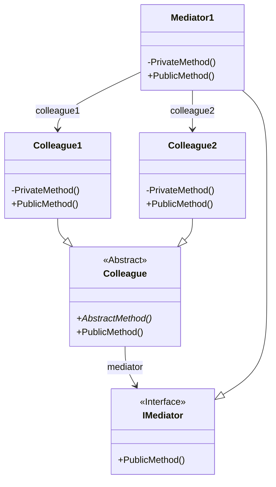

## 定義

> 中介者模式是為了「定義一個封裝了對象間交互關係的對象」。這種方式避免了顯式調用其他類，促進了類間的鬆耦合，並且使得類間交互關係本身可以單獨修改。客戶類可以使用中介者向其他客戶類發送信息，並且通過中介者引發的事件收到信息


```mermaid
classDiagram
  Colleague --> IMediator : mediator
  Mediator1 --|> IMediator
  Mediator1 --> Colleague1 : colleague1
  Mediator1 --> Colleague2 : colleague2
  Colleague1 --|> Colleague
  Colleague2 --|> Colleague
  class IMediator{
    <<Interface>>
    +PublicMethod()
  }
  class Colleague{
    <<Abstract>>
    +AbstractMethod()*
    +PublicMethod()
  }
  class Colleague1{
    -PrivateMethod()
    +PublicMethod()
  }
  class Colleague2{
    -PrivateMethod()
    +PublicMethod()
  }
  class Mediator1{
    -PrivateMethod()
    +PublicMethod()
  }
```

## 例子

<mark>Class(Type)</mark><br>

### Class

```cs

```

## 延伸
