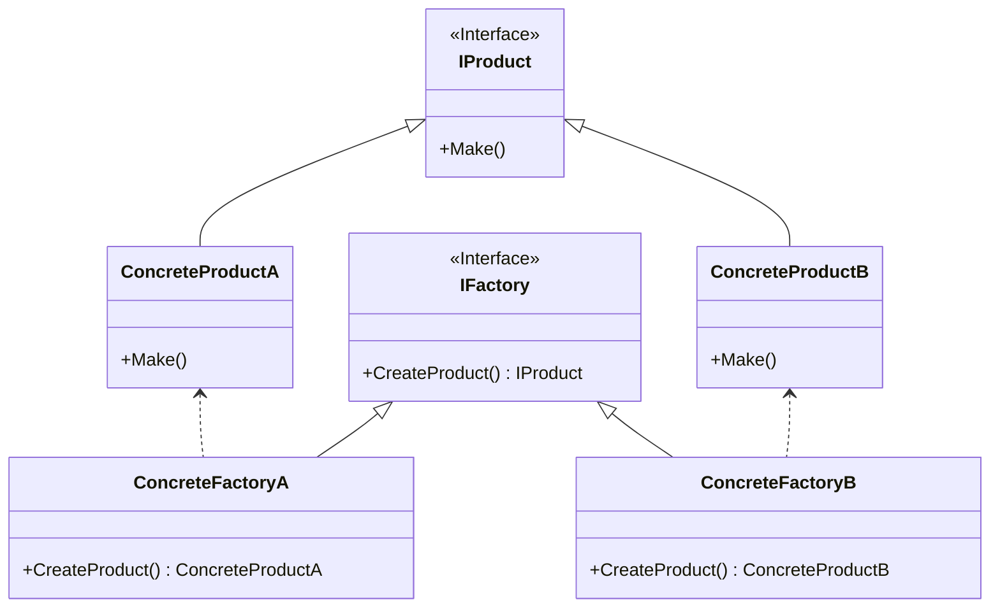

## 用途

> 處理在不指定對象具體類別的情況下建立對象的問題



## 例子

我們可以想像一個<mark>蛋糕店</mark><br/>
蛋糕店可以製作各種類型的<mark>蛋糕</mark>例如巧克力蛋糕、草莓蛋糕、檸檬蛋糕等<br/>
每種蛋糕都有<mark>自己的製作方法和配方</mark>，但老闆不必知道如何製作每一種蛋糕<br/>
相反，老闆將這個責任交給了不同的<mark>蛋糕師傅</mark>，每個蛋糕師傅專門負責製作一種蛋糕

### Product
> 產品的抽象類別或介面，它定義了產品的共同屬性和方法

```cs
// 產品介面
public interface ICake
{
    void Make();
}
```

### Concrete Product
> 產品的具體實現，例如巧克力蛋糕、草莓蛋糕等<br/>
> 每種蛋糕都實現了產品的介面，並提供了自己的製作方法和配方

```cs
// 具體產品：巧克力蛋糕
public class ChocolateCake : ICake
{
    public void Make()
    {
        Console.WriteLine("製作巧克力蛋糕");
    }
}
```
```cs
// 具體產品：草莓蛋糕
public class StrawberryCake : ICake
{
    public void Make()
    {
        Console.WriteLine("製作草莓蛋糕");
    }
}
```

### Factory
> 工廠的抽象類別或介面，它定義了製造產品的方法<br/>
> 這個方法可以根據需要返回不同的具體產品

```cs
// 工廠介面
public interface ICakeFactory
{
    ICake CreateCake();
}
```

### Concrete Factory
> 工廠的具體實現，它實現了製造產品的方法<br/>
> 每個具體工廠專門負責製作一種特定的產品

```cs
// 具體工廠：巧克力蛋糕工廠
public class ChocolateCakeFactory : ICakeFactory
{
    public ICake CreateCake()
    {
        return new ChocolateCake();
    }
}
```
```cs
// 具體工廠：草莓蛋糕工廠
class StrawberryCakeFactory : ICakeFactory
{
    public ICake CreateCake()
    {
        return new StrawberryCake();
    }
}
```

### Client
> 創建工廠以製作蛋糕

```cs
// 創建巧克力蛋糕工廠
ICakeFactory chocolateFactory = new ChocolateCakeFactory();
// 使用巧克力蛋糕工廠製作蛋糕
ICake chocolateCake = chocolateFactory.CreateCake();
chocolateCake.Make();

// 創建草莓蛋糕工廠
ICakeFactory strawberryFactory = new StrawberryCakeFactory();
// 使用草莓蛋糕工廠製作蛋糕
ICake strawberryCake = strawberryFactory.CreateCake();
strawberryCake.Make();
```

## 延伸
