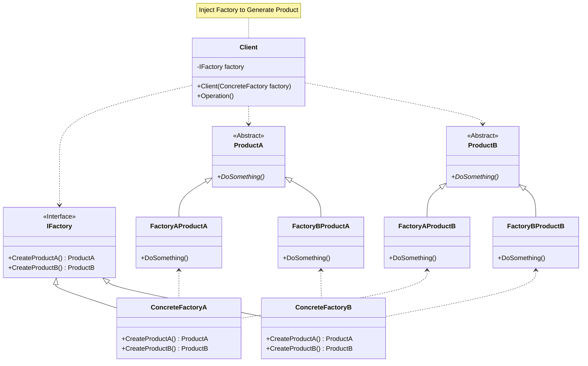

## 用途

> 透過抽象工廠模式使客戶端程式碼與具體產品的實現解耦，提高程式碼的可擴展性和可維護性



## 例子

### GUI

假設我們正在開發一個應用程式，該應用程式需要支援不同的操作系統，如 <mark>Windows</mark> 和 <mark>macOS</mark><br>
而在每個操作系統下，我們需要提供一套相應的 <mark>GUI 控制元件</mark>，如按鈕、文本框和標籤等

在這個例子中，我們可以定義一個<mark>抽象工廠介面 IGUIFactory</mark>，該介面定義了創建不同操作系統下的 GUI 控制元件的方法，如 CreateButton、CreateTextBox 和 CreateLabel

然後，我們實現<mark>具體的工廠類別</mark>，如 WindowsGUIFactory 和 MacOSGUIFactory，它們分別實現了 IGUIFactory 接口<br>
在這些具體工廠類別中，我們可以根據操作系統的不同，創建相應的 GUI 控制元件

接下來，我們定義抽象的 <mark>GUI 控制元件類別</mark>，如 Button、TextBox 和 Label，它們定義了這些控制元件的共同屬性和行為

最後，我們有<mark>具體的 GUI 控制元件類別</mark>，如 WindowsButton、WindowsTextBox、MacOSButton 和 MacOSTextBox，它們分別實現了抽象控制元件類別，並提供了特定操作系統下的控制元件實現

這樣，當我們需要創建 GUI 控制元件時，我們可以使用對應操作系統的具體工廠類別，它們將根據所選的操作系統創建出相應的控制元件<br>
這樣我們就可以通過抽象工廠模式實現操作系統和控制元件的解耦，同時保持程式碼的可擴展性和可維護性

### Product

```cs
// 抽象 GUI 控制元件類別
public abstract class Button
{
    public abstract void Render();
}

public abstract class TextBox
{
    public abstract void Render();
}

public abstract class Label
{
    public abstract void Render();
}
```

```cs
// 具體 MacOS 控制元件類別
public class MacOSButton : Button
{
    public override void Render()
    {
        Console.WriteLine("Render MacOSButton");
    }
}

public class MacOSTextBox : TextBox
{
    public override void Render()
    {
        Console.WriteLine("Render MacOSTextBox");
    }
}

public class MacOSLabel : Label
{
    public override void Render()
    {
        Console.WriteLine("Render MacOSLabel");
    }
}
```

```cs
// 具體 Windows 控制元件類別
public class WindowsButton : Button
{
    public override void Render()
    {
        Console.WriteLine("Render WindowsButton");
    }
}

public class WindowsTextBox : TextBox
{
    public override void Render()
    {
        Console.WriteLine("Render WindowsTextBox");
    }
}

public class WindowsLabel : Label
{
    public override void Render()
    {
        Console.WriteLine("Render WindowsLabel");
    }
}
```

### Factory

```cs
// 抽象工廠介面
public interface IGUIFactory
{
    Button CreateButton();
    TextBox CreateTextBox();
    Label CreateLabel();
}
```

```cs
// 具體的 MacOS 工廠
public class MacOSGUIFactory : IGUIFactory
{
    public Button CreateButton()
    {
        return new MacOSButton();
    }

    public TextBox CreateTextBox()
    {
        return new MacOSTextBox();
    }

    public Label CreateLabel()
    {
        return new MacOSLabel();
    }
}
```

```cs
// 具體的 Windows 工廠
public class WindowsGUIFactory : IGUIFactory
{
    public Button CreateButton()
    {
        return new WindowsButton();
    }

    public TextBox CreateTextBox()
    {
        return new WindowsTextBox();
    }

    public Label CreateLabel()
    {
        return new WindowsLabel();
    }
}
```

### Client

```cs
// 用戶端程式碼
public class Client
{
    private IGUIFactory _guiFactory;

    public Client(IGUIFactory guiFactory)
    {
        _guiFactory = guiFactory;
    }

    public void RenderUI()
    {
        Button button = _guiFactory.CreateButton();
        TextBox textBox = _guiFactory.CreateTextBox();
        Label label = _guiFactory.CreateLabel();

        button.Render();
        textBox.Render();
        label.Render();
    }
}
```

### Program

```cs
// 使用 Windows 工廠
IGUIFactory windowsFactory = new WindowsGUIFactory();
Client windowsClient = new Client(windowsFactory);
windowsClient.RenderUI();

Console.WriteLine();

// 使用 MacOS 工廠
IGUIFactory macosFactory = new MacOSGUIFactory();
Client macosClient = new Client(macosFactory);
macosClient.RenderUI();
```

## 延伸
