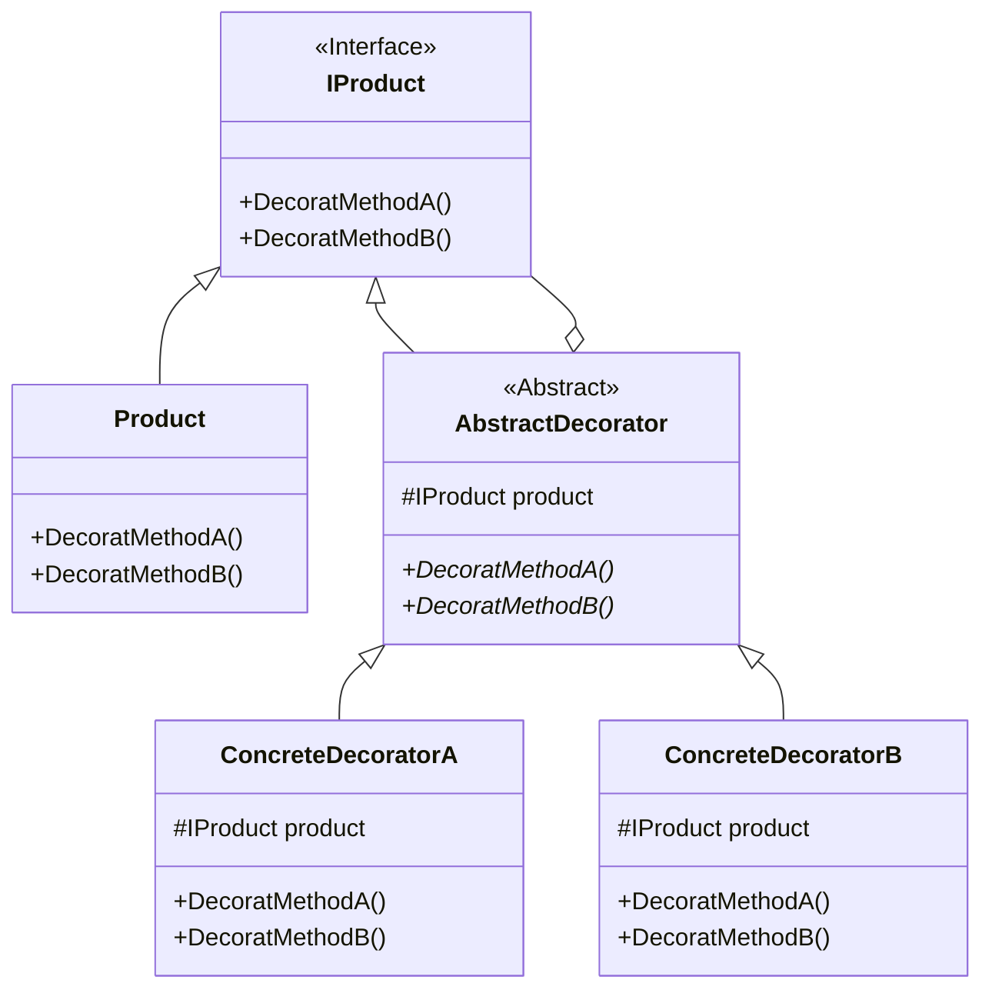

## 用途

> 動態地往一個類別中添加新的行為



## 例子

當談論裝飾器模式（Decorator Pattern）時，我們可以將其比喻為一家咖啡店<br>
在這家咖啡店中，你可以點一杯基本的<mark>咖啡</mark>，然後根據你的喜好和需求，<mark>添加不同的配料和調味品來裝飾你的咖啡</mark>

假設你點了一杯基本的黑咖啡，現在你可以根據自己的喜好，選擇添加牛奶、糖、巧克力粉等配料<br>
每個配料都是一個裝飾器，它們可以動態地包裹住基本的咖啡，並且可以按需增加或移除

### Product

```csharp
// 定義咖啡介面
public interface ICoffee
{
    string GetDescription();
    double GetCost();
}
```

```csharp
// 實現基本的黑咖啡類別
public class BlackCoffee : ICoffee
{
    public string GetDescription()
    {
        return "Black Coffee";
    }

    public double GetCost()
    {
        return 2.0;
    }
}
```

### Decorator

```csharp
// 定義裝飾器基礎類別
public abstract class CoffeeDecorator : ICoffee
{
    protected ICoffee _coffee;

    public CoffeeDecorator(ICoffee coffee)
    {
        _coffee = coffee;
    }

    public virtual string GetDescription()
    {
        return _coffee.GetDescription();
    }

    public virtual double GetCost()
    {
        return _coffee.GetCost();
    }
}
```

### ConcreteDecorator

```csharp
// 實現具體的裝飾器類別
public class MilkDecorator : CoffeeDecorator
{
    public MilkDecorator(ICoffee coffee) : base(coffee)
    {
    }

    public override string GetDescription()
    {
        return base.GetDescription() + ", Milk";
    }

    public override double GetCost()
    {
        return base.GetCost() + 1.0;
    }
}

```

```csharp
public class SugarDecorator : CoffeeDecorator
{
    public SugarDecorator(ICoffee coffee) : base(coffee)
    {
    }

    public override string GetDescription()
    {
        return base.GetDescription() + ", Sugar";
    }

    public override double GetCost()
    {
        return base.GetCost() + 0.5;
    }
}
```

### Client

```csharp
// 點一杯基本的黑咖啡
ICoffee coffee = new BlackCoffee();

// 使用裝飾器進行配料裝飾
ICoffee decoratedCoffee = new MilkDecorator(new SugarDecorator(coffee));

// 獲取咖啡描述和價格
string description = decoratedCoffee.GetDescription();
double cost = decoratedCoffee.GetCost();

Console.WriteLine("Description: " + description);
Console.WriteLine("Cost: $" + cost);
```

## 延伸
