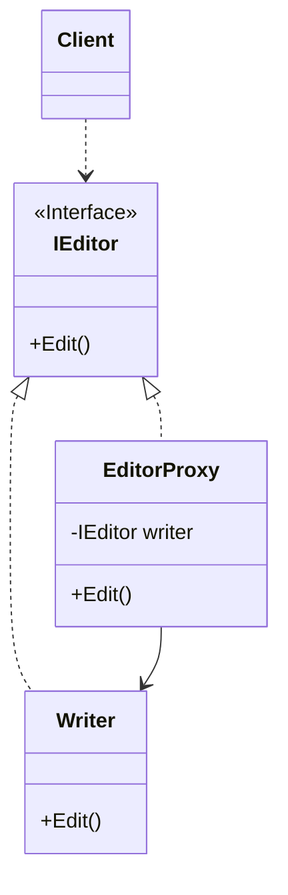

## 用途

> 透過代理控制對要訪問的物件加上一些額外的操作



## 例子

我們可以以一個生活中的例子來解釋<br>
假設你是一個寫<mark>作家</mark>，你創作了一本新小說，現在你需要找一個<mark>編輯</mark>來幫助你校對和編輯你的作品<br>
這時，你可以聘請一個代理人（代理編輯）來處理這些事情，代理人會代表你和編輯進行溝通和協調

在這個例子中，你作為寫作家是主要的角色，但你<mark>不直接與編輯進行互動，而是透過代理人來進行</mark><br>
代理人扮演了一個中間人的角色，處理你和編輯之間的通信和交互

### Interface

```cs
// 定義代理編輯介面
public interface IEditor
{
    void Edit(string content);
}
```

### RealSubject

```cs
// 實現寫作家類別
public class Writer : IEditor
{
    public void Edit(string content)
    {
        Console.WriteLine("Writing: " + content);
    }
}
```

### Proxy

```cs
// 實現代理編輯類別
public class EditorProxy : IEditor
{
    private IEditor _writer;

    public EditorProxy(IEditor writer)
    {
        _writer = writer;
    }

    public void Edit(string content)
    {
        Console.WriteLine("Proxy: Request received for editing");
        // 執行額外的編輯操作
        string editedContent = content.ToUpper();
        // 將編輯後的內容傳遞給寫作家進行寫作
        _writer.Edit(editedContent);
        Console.WriteLine("Proxy: Editing completed");
    }
}
```

### Client

```cs
// 創建寫作家實例
IEditor writer = new Writer();

// 創建代理編輯實例
IEditor editor = new EditorProxy(writer);

// 透過代理編輯進行作品編輯和寫作
editor.Edit("Hello, world!");
```

## 延伸
