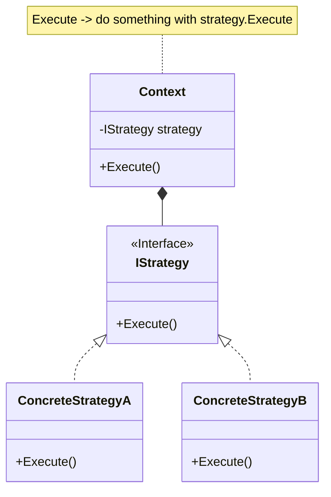

## 用途

> 在演算法中替換一系列可能變動的部分



## 例子

當我們考慮策略模式（Strategy Pattern）時，可以想像自己正在開發一個遊戲，其中有不同類型的角色，每個角色都有不同的攻擊方式<br>
策略模式可以用於實現這樣的場景<br>

假設我們有三個角色：戰士（Warrior）、法師（Mage）和弓箭手（Archer）<br>
每個角色都有不同的攻擊方式，而這些攻擊方式可以在遊戲運行時動態選擇<br>

首先，我們定義一個攻擊策略接口（AttackStrategy），該接口定義了一個攻擊方法<br>
然後，我們實現三個具體的攻擊策略類別，分別對應於不同的角色<br>
接下來，我們定義角色類別（Character），該類別擁有一個攻擊策略屬性，並在攻擊時調用該策略<br>
現在，我們可以創建不同類型的角色並設置不同的攻擊策略<br>
這裡，角色的攻擊方式是通過攻擊策略來決定的，可以根據不同的策略進行動態變更<br>
這使得我們可以在遊戲運行時根據不同情況選擇適當的攻擊策略，提供了靈活性和擴展性<br>

策略模式使得算法的變化獨立於使用該算法的客戶端，並且可以方便地新增或修改攻擊策略而不影響到角色類別的實現<br>

### Strategy

```cs
public interface IAttackStrategy
{
    void Attack();
}
```

### ConcreteStrategy

```cs
public class ArcherAttackStrategy : IAttackStrategy
{
    public void Attack()
    {
        Console.WriteLine("使用弓箭進行遠距離攻擊！");
    }
}

public class MageAttackStrategy : IAttackStrategy
{
    public void Attack()
    {
        Console.WriteLine("使用法術進行遠距離攻擊！");
    }
}

public class WarriorAttackStrategy : IAttackStrategy
{
    public void Attack()
    {
        Console.WriteLine("使用劍進行近距離攻擊！");
    }
}
```

### Context

```cs
public class Character
{
    private IAttackStrategy attackStrategy;

    public Character(IAttackStrategy strategy)
    {
        this.attackStrategy = strategy;
    }

    public void SetAttackStrategy(IAttackStrategy strategy)
    {
        this.attackStrategy = strategy;
    }

    public void Attack()
    {
        attackStrategy.Attack();
    }
}
```

### Client

```cs
var warrior = new Character(new WarriorAttackStrategy());
warrior.Attack();  // 輸出：使用劍進行近距離攻擊！

var mage = new Character(new MageAttackStrategy());
mage.Attack();  // 輸出：使用法術進行遠距離攻擊！

var archer = new Character(new ArcherAttackStrategy());
archer.Attack();  // 輸出：使用弓箭進行遠距離攻擊！
```

## 延伸
