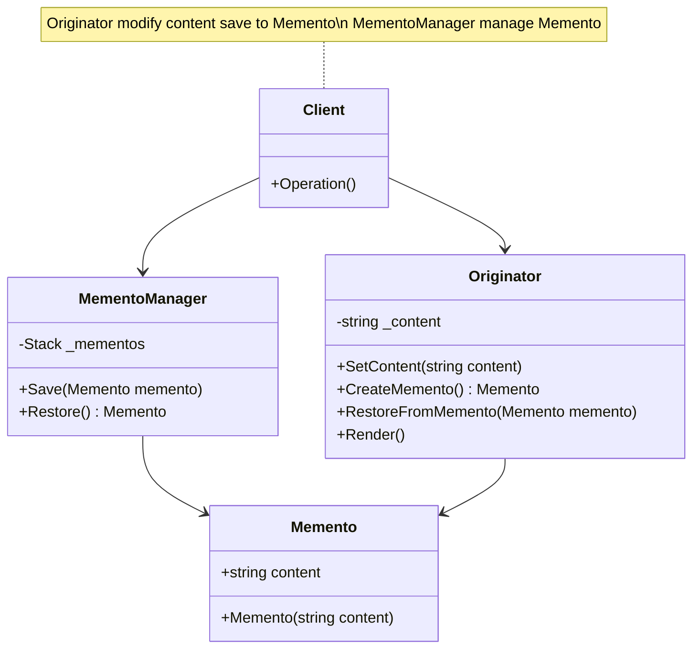

## 用途

> 管理物件狀態的存取



## 例子
當談到備忘錄模式（Memento Pattern）時，我們可以以一個文字編輯器的例子來解釋<br>


假設你正在使用一個<mark>文字編輯器</mark>來編寫一份文件，你希望能夠隨時<mark>保存</mark>編輯的進度，並在需要的時候<mark>恢復</mark>到之前的狀態<br>
這就是備忘錄模式的應用場景<br>


在這個例子中，<mark>文字編輯器</mark>是原發器（Originator），而<mark>文件的狀態</mark>則被稱為備忘錄（Memento）<br>
備忘錄將<mark>保存</mark>原發器的內部狀態，以便在需要時可以<mark>恢復</mark><br>


原發器（TextEditor）負責設置和打印文件的內容，以及創建和恢復備忘錄<br>
備忘錄管理者（MementoManager）負責保存和彈出備忘錄<br>


通過使用備忘錄模式，我們可以隨時保存編輯器的狀態並恢復到先前的狀態<br>
這在需要追蹤或撤銷操作時非常有用<br>


### Memento

```cs
// 備忘錄類別，保存原發器的狀態
public class Memento
{
    public string Content { get; }

    public Memento(string content)
    {
        Content = content;
    }
}
```

### MementoManager

```cs
// 備忘錄管理者類別，負責保存和恢復備忘錄
public class MementoManager
{
    private Stack<Memento> _mementos = new Stack<Memento>();

    public void SaveMemento(Memento memento)
    {
        _mementos.Push(memento);
    }

    public Memento PopMemento()
    {
        return _mementos.Pop();
    }
}
```

### Originator

```cs
// 原發器類別，負責創建和恢復備忘錄
public class TextEditor
{
    private string _content;

    public void SetContent(string content)
    {
        _content = content;
    }

    public Memento CreateMemento()
    {
        return new Memento(_content);
    }

    public void RestoreFromMemento(Memento memento)
    {
        _content = memento.Content;
    }

    public void PrintContent()
    {
        Console.WriteLine($"Current Content: {_content}");
    }
}
```

### Client

```cs
// 使用範例
TextEditor textEditor = new TextEditor();
MementoManager mementoManager = new MementoManager();

textEditor.SetContent("This is the initial content.");
textEditor.PrintContent();

// 保存備忘錄
Memento initialMemento = textEditor.CreateMemento();
mementoManager.SaveMemento(initialMemento);

// 進行編輯操作
textEditor.SetContent("This is the updated content.");
textEditor.PrintContent();

// 恢復到之前的狀態
Memento restoredMemento = mementoManager.PopMemento();
textEditor.RestoreFromMemento(restoredMemento);
textEditor.PrintContent();
```

## 延伸
