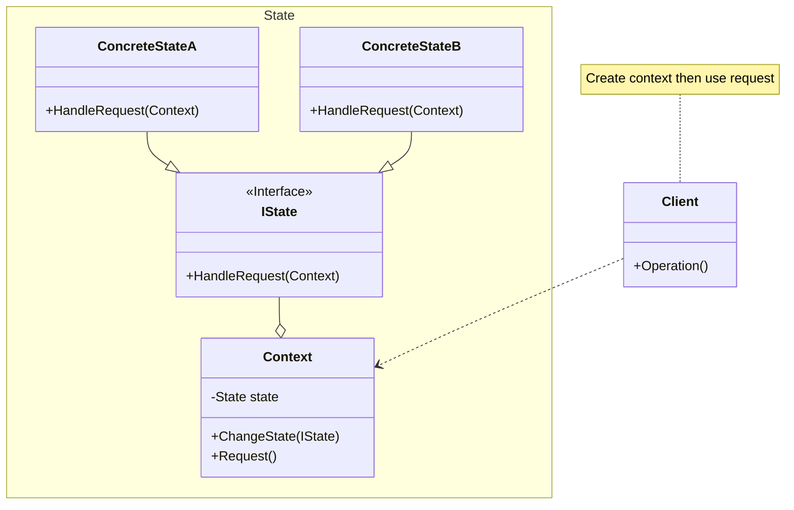

## 用途

> 透過改變狀態來改變行為，讓每個狀態行為獨立易於添加、修改



## 例子

當談到狀態模式（State Pattern）時，我們可以使用<mark>簽核</mark>的情境來解釋<br>
在許多組織或系統中，文件或任務需要經過一系列的<mark>簽核程序</mark><br>
每個簽核階段都有不同的狀態和操作<br>
這個情境可以很好地展示狀態模式的應用。

### State

```csharp
public interface State
{
    void HandleRequest(Context context);
}
```

### ConcreteState

```csharp
public class ConcreteStateA : State
{
    public void HandleRequest(Context context)
    {
        Console.WriteLine("HandleRequest in ConcreteStateA");
        // 改變狀態為ConcreteStateB
        context.ChangeState(new ConcreteStateB());
    }
}
```

```csharp
public class ConcreteStateB : State
{
    public void HandleRequest(Context context)
    {
        Console.WriteLine("HandleRequest in ConcreteStateB");
        // 改變狀態為ConcreteStateA
        context.ChangeState(new ConcreteStateA());
    }
}
```

### Context

```csharp
public class Context
{
    private State currentState;

    public Context()
    {
        // 初始狀態為ConcreteStateA
        currentState = new ConcreteStateA();
    }

    public void ChangeState(State state)
    {
        currentState = state;
    }

    public void Request()
    {
        // 呼叫當前狀態的操作
        currentState.HandleRequest(this);
    }
}
```

### Client

```csharp
// 使用範例
Context context = new Context();
context.Request();  // 輸出: HandleRequest in ConcreteStateA
context.Request();  // 輸出: HandleRequest in ConcreteStateB
context.Request();  // 輸出: HandleRequest in ConcreteStateA
```

## 延伸
