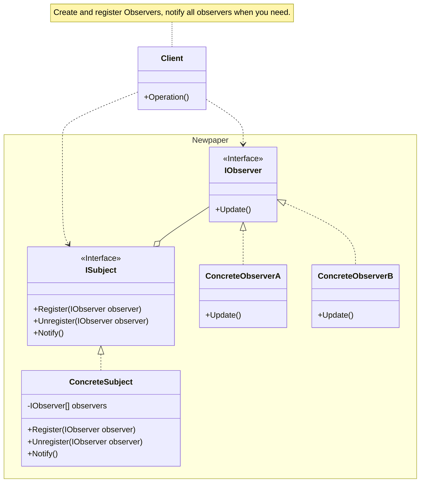

## 用途

> 管理相依的觀察者，在被觀察對象發生變動發出通知觀察者



## 例子

觀察者模式（Observer Pattern）是一種行為型設計模式，它定義了一種一對多的依賴關係，讓一個物件的狀態改變時，所有依賴它的物件都會得到通知並自動更新<br>
這種模式常被用於實現分布式事件處理系統<br>

在報社和訂閱者的例子中，可以<mark>將報社視為被觀察者（Subject）</mark>，而<mark>訂閱者則是觀察者（Observer）</mark><br>
當報社發佈新的報紙時，所有訂閱者都應該得到通知，以便他們可以取得最新的新聞<br>

以下是觀察者模式在報社和訂閱者情境中的概念解釋：

#### 被觀察者（Subject，報社）：

報社是被觀察者，它維護一個訂閱者列表，追蹤所有訂閱它的人或系統<br>
當報社有新的報紙發佈時，它會通知所有訂閱者，告訴他們有新的資訊可用<br>

#### 觀察者（Observer，訂閱者）：

訂閱者是觀察者，它們註冊在報社上，表示他們有興趣接收最新的新聞<br>
每個訂閱者實現一個更新方法，當被觀察者通知時，這個方法被呼叫，以便訂閱者可以更新自己的狀態，例如取得最新的報紙內容<br>

#### 通知機制：

當報社有新的報紙時，它遍歷訂閱者列表，呼叫每個訂閱者的更新方法，通知它們有新的資訊可用<br>
訂閱者收到通知後，執行相應的操作，例如讀取最新報紙<br>

#### 松耦合（Loose Coupling）：

觀察者模式實現了松耦合，報社和訂閱者之間的關係是鬆散的<br>
報社不需要知道訂閱者的詳細實現，只需知道它們有一個更新方法即可<br>
新的訂閱者可以輕鬆加入，不會影響報社，反之亦然<br>
例子：

報社發佈新報紙，所有訂閱者（讀者）都能及時獲得通知並閱讀最新的內容<br>
每個訂閱者可以獨立地處理通知，不影響其他訂閱者<br>
總的來說，觀察者模式提供了一種有效的方法，使物件之間能夠動態地建立關係，並保持低耦合度，同時允許一對多的通信<br>
在報社和訂閱者的例子中，這種模式使得報社和訂閱者之間的關係更靈活，並且方便了新的訂閱者的加入<br>

### Observer

```cs
// 訂閱者（讀者）
public interface IObserver
{
    void Update(string news);  // 更新訊息
}
```

### Concrete Observer

```cs
// 讀者
public class Reader : IObserver
{
    public string Name { get; }

    public Reader(string name)
    {
        Name = name;
    }

    public void Update(string news)
    {
        Console.WriteLine($"Reader {Name} received news: {news}");
    }
}
```

### Subject

```cs
// 主題（報社）
public interface ISubject
{
    // 註冊訂閱者
    void Register(IObserver observer);
    // 取消註冊訂閱者
    void Unregister(IObserver observer);
    // 通知訂閱者
    void Notify();
}
```

### Concrete Subject

```cs
// 報社
public class Newspaper : ISubject
{
    private List<IObserver> observers;
    private string latestNews;

    public Newspaper()
    {
        observers = new List<IObserver>();
    }

    public void Register(IObserver observer)
    {
        observers.Add(observer);
    }

    public void Unregister(IObserver observer)
    {
        observers.Remove(observer);
    }

    public void Notify()
    {
        foreach (var observer in observers)
        {
            observer.Update(latestNews);
        }
    }

    public void PublishNews(string news)
    {
        latestNews = news;
        Notify();
    }
}
```

### Client

```cs
Newspaper newspaper = new Newspaper();
Reader reader1 = new Reader("John");
Reader reader2 = new Reader("Alice");

newspaper.Register(reader1);
newspaper.Register(reader2);

newspaper.PublishNews("Breaking News: COVID-19 vaccine approved!");

newspaper.Unregister(reader2);

newspaper.PublishNews("Sports: Home team wins the championship!");

// 輸出:
// Reader John received news: Breaking News: COVID-19 vaccine approved!
// Reader Alice received news: Breaking News: COVID-19 vaccine approved!
// Reader John received news: Sports: Home team wins the championship!
```

## 延伸

- RxJS: Observable
