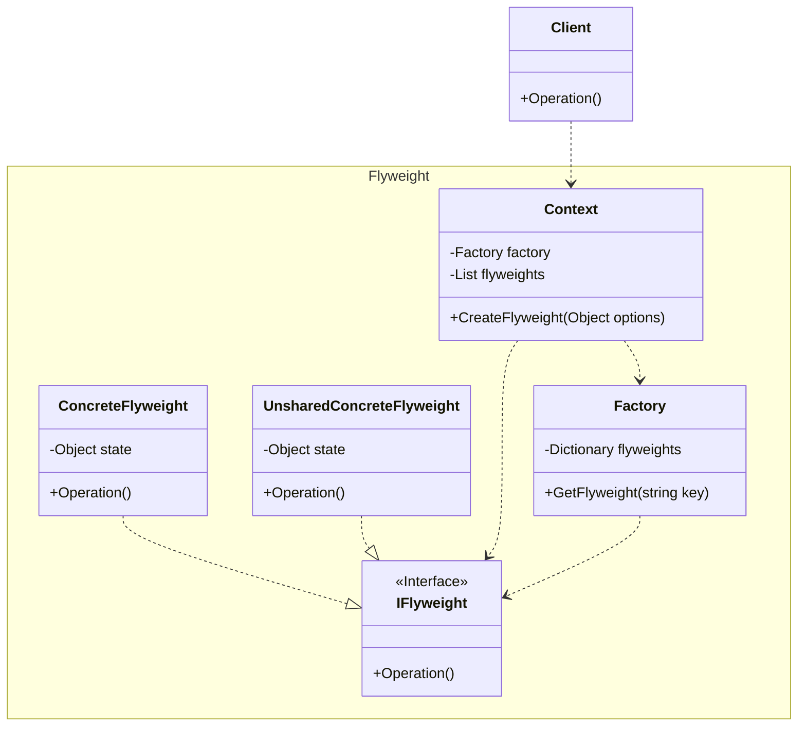

## 用途

> 節省記憶體和資源，並提高的效能



## 例子

當談到享元模式（Flyweight Pattern）時，我們可以以一個生活中的例子來解釋<br>
假設你是一位遊戲開發者，正在開發一個多人射擊遊戲<br>
在這個遊戲中，你需要創建許多不同的角色，包括不同種類的士兵和敵人<br>

使用享元模式，你可以節省記憶體和資源，並提高遊戲的效能<br>
你可以將那些具有共享特徵的角色，例如外觀和行為，提取出來並共用，而不是為每個角色創建一個獨立的物件<br>

舉個例子，假設你有多個士兵角色，它們之間的外觀和行為非常相似，唯一的區別可能只是顏色和武器<br>
在享元模式中，你會創建一個士兵享元工廠，該工廠負責管理和提供士兵物件<br>

當遊戲需要創建士兵時，你可以向享元工廠請求一個士兵物件，並提供所需的參數，例如顏色和武器<br>
享元工廠會檢查是否已經存在具有相同參數的士兵物件，如果存在，則返回該物件的引用，否則創建一個新的士兵物件並將其加入享元池中<br>

這樣一來，不同士兵之間可以共享相同的外觀和行為，只有具有不同參數的部分是獨立的<br>
這樣可以節省大量的記憶體和資源，同時提高遊戲的效能<br>

請注意，享元模式適用於具有大量重複性物件的情況，並且這些物件可以在某些方面共享<br>
它的目標是減少內存使用和提高效能<br>

### Product

```cs
// 遊戲角色介面
public interface ICharacter
{
    void Display();
}
```

### Concrete Product

```cs
// 具體角色類別
public class Warrior : ICharacter
{
    private string name;
    private int level;

    public Warrior(string name, int level)
    {
        this.name = name;
        this.level = level;
    }

    public void Display()
    {
        Console.WriteLine($"Warrior - Name: {name}, Level: {level}");
    }
}
```

```cs
public class Mage : ICharacter
{
    private string name;
    private int level;

    public Mage(string name, int level)
    {
        this.name = name;
        this.level = level;
    }

    public void Display()
    {
        Console.WriteLine($"Mage - Name: {name}, Level: {level}");
    }
}
```

### Factory

```cs
// 角色工廠
public class CharacterFactory
{
    private Dictionary<string, ICharacter> characters = new Dictionary<string, ICharacter>();

    public ICharacter GetCharacter(string characterType, string name, int level)
    {
        // 檢查角色是否已存在，如果存在則返回該角色
        if (characters.ContainsKey(characterType))
        {
            return characters[characterType];
        }
        else
        {
            // 如果角色不存在，則根據角色類型創建一個新角色並將其添加到字典中
            ICharacter character;
            switch (characterType)
            {
                case "Warrior":
                    character = new Warrior(name, level);
                    break;
                case "Mage":
                    character = new Mage(name, level);
                    break;
                default:
                    throw new ArgumentException($"Invalid character type: {characterType}");
            }
            characters.Add(characterType, character);
            return character;
        }
    }
}
```

### Context

```cs

// 使用範例
public class Game
{
    private CharacterFactory characterFactory = new CharacterFactory();

    public void CreateCharacter(string characterType, string name, int level)
    {
        // 從角色工廠獲取角色物件
        ICharacter character = characterFactory.GetCharacter(characterType, name, level);

        // 創建角色並加入遊戲
        // ...
    }
}
```

### Client

```cs
var game = new Game();

game.CreateCharacter("Mage", "David", 1);
game.CreateCharacter("Warrior", "Marry", 10);
```

## 延伸
