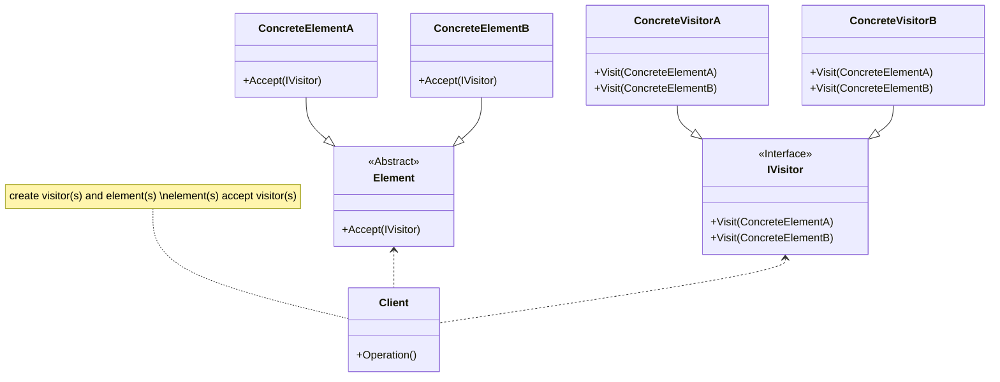

## 用途

> 將操作從元素的類別中分離出來，並將其封裝在訪問者類別中
>
> 在不修改元素類別的情況下，可以輕鬆地新增新的操作或訪問者



## 例子

當談到訪問者模式（Visitor Pattern）時，我們可以以一個動物園的例子來解釋<br>

假設我們有一個動物園，裡面有各種<mark>動物，如獅子、老虎、長頸鹿等</mark><br>
現在我們想要對每一種動物<mark>進行不同的操作，例如測量體重、給予特定的食物等</mark><br>
這時可以使用訪問者模式來實現這些操作<br>

在範例中，我們定義了抽象的動物訪問者（IAnimalVisitor）和具體的獅子、老虎和長頸鹿類別，這些動物類別都繼承自基礎動物類別（Animal）<br>
每個動物類別都實現了 Accept 方法，接受訪問者對其進行操作<br>

我們還定義了具體的訪問者（AnimalOperationVisitor），並根據不同的動物進行不同的操作<br>
在使用範例中，我們創建了獅子、老虎和長頸鹿的實例，並使用訪問者來進行相應的操作<br>

訪問者模式可以幫助我們將操作從元素的類別中分離出來，並將其封裝在訪問者類別中<br>
這樣做的好處是在不修改元素類別的情況下，可以輕鬆地新增新的操作或訪問者<br>
這在需要對一個結構中的元素進行多種操作時特別有用<br>

### Element

```csharp
// 基礎動物類別
public abstract class Animal
{
    public abstract void Accept(IAnimalVisitor visitor);
}
```

```csharp
// 長頸鹿類別
public class Giraffe : Animal
{
    public override void Accept(IAnimalVisitor visitor)
    {
        visitor.Visit(this);
    }
}
```

```csharp
// 獅子類別
public class Lion : Animal
{
    public override void Accept(IAnimalVisitor visitor)
    {
        visitor.Visit(this);
    }
}
```

```csharp
// 老虎類別
public class Tiger : Animal
{
    public override void Accept(IAnimalVisitor visitor)
    {
        visitor.Visit(this);
    }
}
```

### Visitor

```csharp
// 抽象動物訪問者
public interface IAnimalVisitor
{
    void Visit(Lion lion);
    void Visit(Tiger tiger);
    void Visit(Giraffe giraffe);
}
```

### OperationVisitor

```csharp
// 具體訪問者，用於實現不同的操作
public class AnimalOperationVisitor : IAnimalVisitor
{
    public void Visit(Lion lion)
    {
        Console.WriteLine("測量獅子體重");
    }

    public void Visit(Tiger tiger)
    {
        Console.WriteLine("給老虎餵食");
    }

    public void Visit(Giraffe giraffe)
    {
        Console.WriteLine("觀察長頸鹿行為");
    }
}
```

### Client

```csharp
// 使用範例
Animal lion = new Lion();
Animal tiger = new Tiger();
Animal giraffe = new Giraffe();

IAnimalVisitor operationVisitor = new AnimalOperationVisitor();

lion.Accept(operationVisitor);
tiger.Accept(operationVisitor);
giraffe.Accept(operationVisitor);
```

## 延伸
