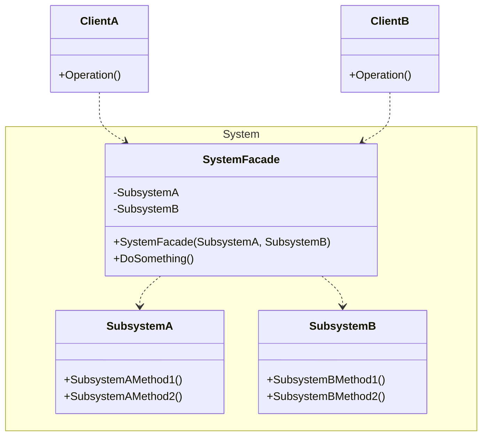

## 用途

> 提供了一個簡化的介面，用來操作複雜的子系統



## 例子

當談到外觀模式（Facade Pattern）時，我們可以以一個家庭影院系統為例來解釋<br>

想像一下，你有一個家<mark>庭影院系統</mark>，包含了<mark>多個複雜的子系統，如投影機、音響、DVD播放器等等</mark><br>
每個子系統都有自己的操作和配置方式<br>
當你想要觀賞電影時，你必須依次操作每個子系統，調整它們的狀態和連接方式<br>
這樣的操作可能相當繁瑣和複雜<br>

在這種情況下，外觀模式就派上用場了<br>
外觀模式提供了一個<mark>簡化的介面</mark>，用於<mark>操作複雜的子系統</mark><br>
它將子系統的操作進行封裝，提供一個統一的入口點，使使用者可以方便地操作整個家庭影院系統，而不必了解每個子系統的細節<br>


### Subsystem

```cs
// 音響子系統
public class AudioSystem
{
    public void TurnOn()
    {
        Console.WriteLine("Audio system is turned on.");
    }

    public void TurnOff()
    {
        Console.WriteLine("Audio system is turned off.");
    }

    public void SetVolume(int volume)
    {
        Console.WriteLine("Audio system volume is set to " + volume);
    }
}
```

```cs
// DVD播放器子系統
public class DVDPlayer
{
    public void TurnOn()
    {
        Console.WriteLine("DVD player is turned on.");
    }

    public void TurnOff()
    {
        Console.WriteLine("DVD player is turned off.");
    }

    public void Play()
    {
        Console.WriteLine("DVD player is playing.");
    }
}
```

```cs
// 投影機子系統
public class Projector
{
    public void TurnOn()
    {
        Console.WriteLine("Projector is turned on.");
    }

    public void TurnOff()
    {
        Console.WriteLine("Projector is turned off.");
    }

    public void SetInput(string input)
    {
        Console.WriteLine("Projector input is set to " + input);
    }
}
```

### Facade

```cs
// 家庭影院外觀類別
public class HomeTheaterFacade
{
    private Projector projector;
    private AudioSystem audioSystem;
    private DVDPlayer dvdPlayer;

    public HomeTheaterFacade()
    {
        projector = new Projector();
        audioSystem = new AudioSystem();
        dvdPlayer = new DVDPlayer();
    }

    public void WatchMovie()
    {
        Console.WriteLine("Preparing the home theater system for watching a movie...");
        projector.TurnOn();
        audioSystem.TurnOn();
        dvdPlayer.TurnOn();

        projector.SetInput("DVD Player");
        audioSystem.SetVolume(10);

        dvdPlayer.Play();
    }

    public void StopMovie()
    {
        Console.WriteLine("Stopping the movie and turning off the home theater system...");
        dvdPlayer.TurnOff();
        audioSystem.TurnOff();
        projector.TurnOff();
    }
}
```

### Client

```cs
var homeTheater = new HomeTheaterFacade();

// 觀賞電影
homeTheater.WatchMovie();

// 停止觀賞電影
homeTheater.StopMovie();
```


## 延伸
