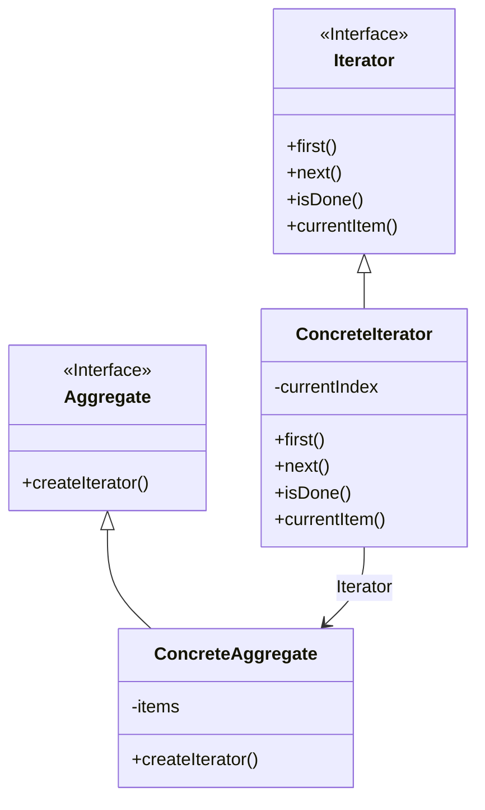

## 用途

迭代器模式（Iterator Pattern）是一種行為型設計模式，它提供了一種方法來依序存取一個聚合物件中的各個元素，而無需暴露其內部實作細節。這個模式主要用於遍歷集合物件的元素，例如清單、陣列或其他集合類型，而不需要了解集合的底層實作方式。

### 主要特色：
- **統一介面**：透過提供一個統一的介面來遍歷不同類型的集合。
- **解耦合**：將集合的遍歷操作與集合本身的實作分離。
- **彈性**：可以在不改變集合物件的情況下定義新的迭代器。

### 適用情境：
- 需要存取一個集合物件的內容而不暴露其內部表示。
- 需要為不同的集合結構提供統一的遍歷介面。
- 需要支援多種遍歷方式。



## 例子

以下是一個使用 C# 語言實作的迭代器模式範例：

```csharp
using System;
using System.Collections;
using System.Collections.Generic;

// 定義迭代器介面
public interface IIterator<T>
{
    T Current { get; }
    bool MoveNext();
    void Reset();
}

// 定義集合介面
public interface IAggregate<T>
{
    IIterator<T> CreateIterator();
}

// 實作具體的集合
public class ConcreteAggregate<T> : IAggregate<T>
{
    private List<T> _items = new List<T>();

    public IIterator<T> CreateIterator()
    {
        return new ConcreteIterator<T>(this);
    }

    public int Count => _items.Count;

    public T this[int index]
    {
        get => _items[index];
        set => _items.Insert(index, value);
    }
}

// 實作具體的迭代器
public class ConcreteIterator<T> : IIterator<T>
{
    private ConcreteAggregate<T> _aggregate;
    private int _currentIndex = -1;

    public ConcreteIterator(ConcreteAggregate<T> aggregate)
    {
        _aggregate = aggregate;
    }

    public T Current => _aggregate[_currentIndex];

    public bool MoveNext()
    {
        if (_currentIndex + 1 < _aggregate.Count)
        {
            _currentIndex++;
            return true;
        }
        return false;
    }

    public void Reset()
    {
        _currentIndex = -1;
    }
}

// 使用範例
class Program
{
    static void Main(string[] args)
    {
        ConcreteAggregate<string> collection = new ConcreteAggregate<string>();
        collection[0] = "項目 1";
        collection[1] = "項目 2";
        collection[2] = "項目 3";

        IIterator<string> iterator = collection.CreateIterator();

        while (iterator.MoveNext())
        {
            Console.WriteLine(iterator.Current);
        }
    }
}
```

這個範例展示了如何使用迭代器模式來遍歷一個集合，並且不需要了解集合的內部實作細節。

## 延伸

迭代器模式有幾種常見的變體和延伸：

### 外部迭代器 vs 內部迭代器
- **外部迭代器**：由客戶端控制迭代過程，如上面的範例
- **內部迭代器**：由迭代器本身控制迭代過程，客戶端只需提供回調函式

### 相關模式
- **組合模式（Composite Pattern）**：經常與迭代器模式一起使用
- **訪問者模式（Visitor Pattern）**：可以與迭代器模式結合來遍歷複雜的物件結構

### 實際應用
- .NET Framework 中的 `IEnumerable<T>` 和 `IEnumerator<T>`
- Java 中的 `Iterator` 介面
- 資料庫查詢結果的遍歷
- 檔案系統的目錄遍歷
