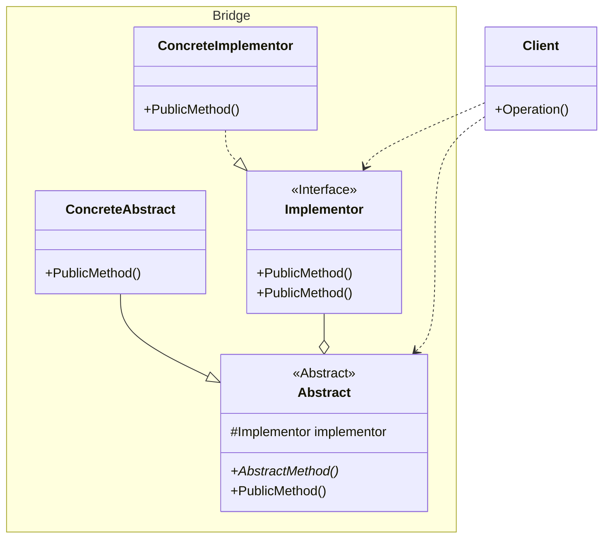

## 用途

> 把事物對象和其具體行爲、具體特徵分離開來，使它們可以各自獨立的變化。



## 例子

當談到橋接模式（Bridge Pattern）時，我們可以以一個汽車製造公司為例來解釋<br>

假設你正在設計一個汽車製造系統，其中包含<mark>不同類型的汽車和引擎</mark><br>
每種汽車都有不同的功能和特性，並且可以搭配不同種類的引擎<br>
使用橋接模式，你可以將汽車和引擎之間的抽象和實現分離，使它們可以獨立地變化<br>

### Implementor

```cs
// 引擎抽象類別
public abstract class Engine
{
    public abstract void Start();
    public abstract void Stop();
}
```

### Concrete Implementor

```cs
// 具體引擎類別
public class GasolineEngine : Engine
{
    public override void Start()
    {
        Console.WriteLine("Gasoline engine starts.");
    }

    public override void Stop()
    {
        Console.WriteLine("Gasoline engine stops.");
    }
}
```

```cs
public class ElectricEngine : Engine
{
    public override void Start()
    {
        Console.WriteLine("Electric engine starts.");
    }

    public override void Stop()
    {
        Console.WriteLine("Electric engine stops.");
    }
}
```

### Abstract

```cs
// 汽車抽象類別
public abstract class Car
{
    protected Engine engine;

    public Car(Engine engine)
    {
        this.engine = engine;
    }

    public abstract void Drive();
}
```

### Refined Abstraction

```cs
// SUV 具體汽車類別
public class SUV : Car
{
    public SUV(Engine engine) : base(engine)
    {
    }

    public override void Drive()
    {
        Console.WriteLine("Driving an SUV.");
        engine.Start();
        // 其他操作
        engine.Stop();
    }
}
```

```cs
// Sedan 具體汽車類別
public class Sedan : Car
{
    public Sedan(Engine engine) : base(engine)
    {
    }

    public override void Drive()
    {
        Console.WriteLine("Driving a sedan.");
        engine.Start();
        // 其他操作
        engine.Stop();
    }
}
```

### Client

```cs
// 創建汽車
Engine gasolineEngine = new GasolineEngine();
Car sedan = new Sedan(gasolineEngine);
Car suv = new SUV(gasolineEngine);

Engine electricEngine = new ElectricEngine();
Car sedan2 = new Sedan(electricEngine);
Car suv2 = new SUV(electricEngine);

// 駕駛汽車
sedan.Drive();
suv.Drive();

sedan2.Drive();
suv2.Drive();
```

## 延伸
