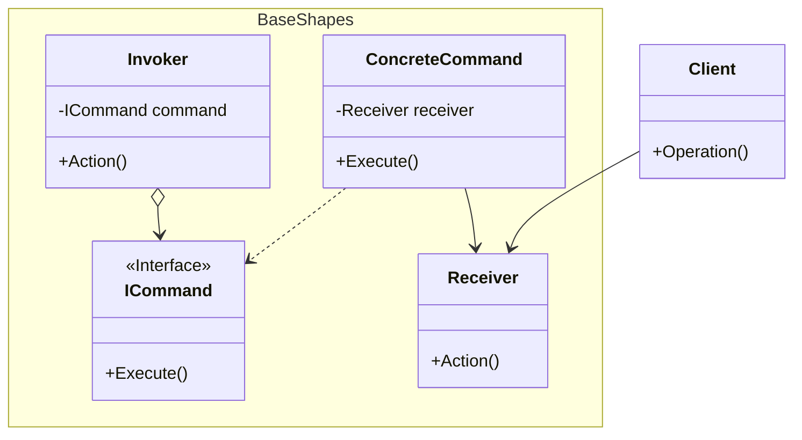

## 用途

> 將請求封裝成一個對象，從而使您可以用不同的請求對客戶進行參數化



## 例子

當我們談到命令模式（Command Pattern）時，可以想像成餐廳點餐的情境<br>
在餐廳中，<mark>客人（Client）</mark>與<mark>服務生（Invoker）</mark>之間存在著一個命令的傳遞過程，客人發出點餐的命令，服務生接收並執行這個命令。

客人（Client）創建了一個<mark>點餐命令（OrderCommand）</mark>，並將其綁定到特定的廚師（Chef）<br>
服務生（Waiter）接收這個命令並執行它，將命令傳遞給廚師，然後廚師根據命令進行烹飪。

命令模式將<mark>命令的發出者（Client）和執行者（Receiver）解耦</mark>，使得發出命令的對象不需要關心命令的執行細節<br>
這種模式可以將命令封裝成對象，使其可以被存儲、傳遞和撤銷，同時也提供了一個彈性的方式來構建命令的組合和連續執行。

### Command

```cs
// 命令接口
public interface ICommand
{
    void Execute();
}
```

### Concrete Command

```cs
// 命令實現 - 點餐命令
public class OrderCommand : ICommand
{
    private readonly Chef chef;
    private readonly string dish;

    public OrderCommand(Chef chef, string dish)
    {
        this.chef = chef;
        this.dish = dish;
    }

    public void Execute()
    {
        chef.Cook(dish);
    }
}
```

### Receiver

```cs
// 命令接收者 - 廚師
public class Chef
{
    public void Cook(string dish)
    {
        Console.WriteLine($"Chef is cooking {dish}");
    }
}
```

### Invoker

```cs
// 服務生（Invoker）
public class Waiter
{
    private readonly ICommand command;

    public Waiter(ICommand command)
    {
        this.command = command;
    }

    public void TakeOrder()
    {
        command.Execute();
    }
}
```

### Client

```cs
Chef chef = new Chef();
ICommand orderCommand = new OrderCommand(chef, "Steak");
Waiter waiter = new Waiter(orderCommand);

waiter.TakeOrder();

// 輸出:
// Chef is cooking Steak
```

## 延伸
