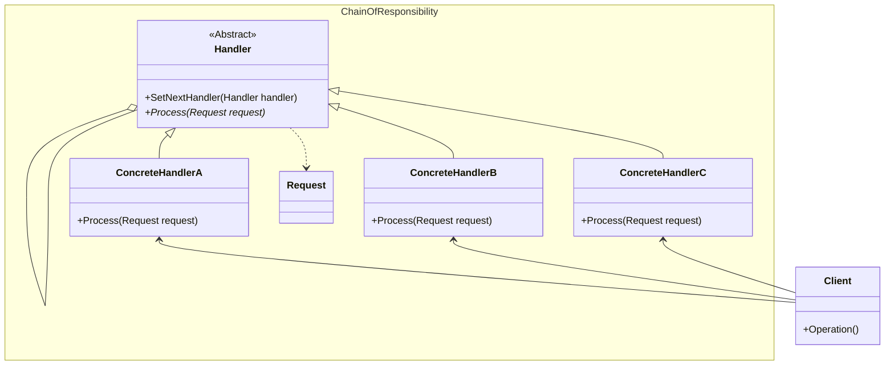

## 用途

> 將責任分割、鏈結，一步一步處理請求



## 例子

當談到責任鏈模式（Chain of Responsibility Pattern）時，我們可以以一個請假申請的例子來解釋<br>

假設你是一家公司的員工，你需要向你的上級提出請假申請<br>
在公司中，有不同級別的管理人員，包括小組長、部門經理和總經理<br>
每個管理人員都有不同的權限和批准請假的能力<br>

使用責任鏈模式可以實現這樣的請假申請流程，讓請假申請依次經過不同級別的管理人員進行審批，直到找到可以批准請假的人為止<br>

在範例中，請假申請先經過小組長的審批，如果小組長無法批准，則交給部門經理審批，如果部門經理也無法批准，則交給總經理審批<br>

這樣，請假申請就會依次經過不同級別的管理人員進行審批，直到找到可以批准請假的人為止<br>
這種方式可以實現彈性的審批流程，並且可以輕鬆地新增或更改管理人員的層級和權限<br>

### Request

```cs
// 請假申請類別
public class LeaveRequest
{
    public string EmployeeName { get; set; }
    public int LeaveDays { get; set; }
}
```

### Handler

```cs
// 抽象處理者類別
public abstract class Approver
{
    protected Approver NextApprover;

    public void SetNextApprover(Approver nextApprover)
    {
        NextApprover = nextApprover;
    }

    public abstract void ProcessRequest(LeaveRequest request);
}
```

### Concrete Handler

```cs
// 小組長類別
public class TeamLeader : Approver
{
    public override void ProcessRequest(LeaveRequest request)
    {
        if (request.LeaveDays <= 2)
        {
            Console.WriteLine($"小組長批准 {request.EmployeeName} 的請假申請");
        }
        else if (NextApprover != null)
        {
            NextApprover.ProcessRequest(request);
        }
    }
}
```

```cs
// 部門經理類別
public class DepartmentManager : Approver
{
    public override void ProcessRequest(LeaveRequest request)
    {
        if (request.LeaveDays <= 5)
        {
            Console.WriteLine($"部門經理批准 {request.EmployeeName} 的請假申請");
        }
        else if (NextApprover != null)
        {
            NextApprover.ProcessRequest(request);
        }
    }
}
```

```cs
// 總經理類別
public class GeneralManager : Approver
{
    public override void ProcessRequest(LeaveRequest request)
    {
        if (request.LeaveDays > 5)
        {
            Console.WriteLine($"總經理批准 {request.EmployeeName} 的請假申請");
        }
    }
}
```

### Client

```cs
// 使用範例
LeaveRequest leaveRequest = new LeaveRequest
{
    EmployeeName = "John",
    LeaveDays = 4
};

Approver teamLeader = new TeamLeader();
Approver departmentManager = new DepartmentManager();
Approver generalManager = new GeneralManager();

teamLeader.SetNextApprover(departmentManager);
departmentManager.SetNextApprover(generalManager);

teamLeader.ProcessRequest(leaveRequest);
```

## 延伸
